# Entity Relationship Diagram

This is the current data model for the Instagram clone backend. Every table is
shown below. The diagram is kept in sync with the Django models; the legacy
`ERD.drawio` / `ERD.png` artifacts mirror the same structure.

Conventions:

- All tables inherit `created_at` / `updated_at` from `TimeStampedModel`.
- Tables that support soft delete (`Post`, `Comment`, `Story`, `StoryComment`,
  `Message`, `Notification`) additionally have a nullable `deleted_at`.
- `PK` = primary key, `FK` = foreign key, `UK` = unique. Only the distinctive
  business columns are listed to keep the diagram readable.
- `Notification.target` is a generic foreign key (Django `ContentType` framework)
  and can point at a `Post`, `Comment`, `User`, `Story` or `Message`.

```mermaid
erDiagram
    USER ||--|| PROFILE : has
    USER ||--o{ AUTHSESSION : opens
    USER ||--o{ FOLLOW : "follows (follower)"
    USER ||--o{ FOLLOW : "is followed (following)"
    USER ||--o{ BLOCK : "blocks (blocker)"
    USER ||--o{ BLOCK : "is blocked (blocked)"
    USER ||--o{ POST : authors
    USER ||--o{ POSTLIKE : likes
    USER ||--o{ SAVEDPOST : saves
    USER ||--o{ COMMENT : writes
    USER ||--o{ STORY : posts
    USER ||--o{ STORYVIEW : views
    USER ||--o{ STORYCOMMENT : writes
    USER ||--o{ CONVERSATION : created
    USER ||--o{ CONVERSATIONPARTICIPANT : joins
    USER ||--o{ MESSAGE : sends
    USER ||--o{ MESSAGERECIPIENTSTATUS : receives
    USER ||--o{ MESSAGEUSERSTATE : owns
    USER ||--o{ NOTIFICATION : "receives (recipient)"
    USER ||--o{ NOTIFICATION : "triggers (actor)"

    POST ||--o{ POSTMEDIA : has
    POST ||--o{ POSTHASHTAG : "tagged with"
    HASHTAG ||--o{ POSTHASHTAG : tags
    POST ||--o{ POSTLIKE : receives
    POST ||--o{ SAVEDPOST : "saved in"
    POST ||--o{ COMMENT : has
    COMMENT ||--o{ COMMENT : "replies to"

    STORY ||--o{ STORYVIEW : has
    STORY ||--o{ STORYCOMMENT : has
    STORYCOMMENT ||--o{ STORYCOMMENT : "replies to"
    STORY ||--o{ MESSAGE : "replied to in"

    CONVERSATION ||--o{ CONVERSATIONPARTICIPANT : has
    CONVERSATION ||--o{ MESSAGE : contains
    MESSAGE ||--o{ MESSAGERECIPIENTSTATUS : tracks
    MESSAGE ||--o{ MESSAGEUSERSTATE : tracks
    MESSAGE ||--o{ CONVERSATIONPARTICIPANT : "last read by"

    CONTENTTYPE ||--o{ NOTIFICATION : "target (generic)"

    USER {
        bigint id PK
        string username UK
        string email UK
        string phone_number UK
        bool is_active
        bool is_email_verified
        bool is_phone_verified
    }
    PROFILE {
        bigint id PK
        bigint user_id FK
        string display_name
        text bio
        image avatar
        bool is_private
        bool is_active
    }
    AUTHSESSION {
        bigint id PK
        bigint user_id FK
        string jti UK
        text refresh_token
        string ip_address
        bool is_revoked
        datetime expires_at
    }
    FOLLOW {
        bigint id PK
        bigint follower_id FK
        bigint following_id FK
    }
    BLOCK {
        bigint id PK
        bigint blocker_id FK
        bigint blocked_id FK
    }
    POST {
        bigint id PK
        bigint author_id FK
        text caption
        int like_count
        int comment_count
        int save_count
        int view_count
        datetime deleted_at
    }
    POSTMEDIA {
        bigint id PK
        bigint post_id FK
        string media_type
        file media
        int sort_order
        image thumbnail
        int duration_seconds
    }
    HASHTAG {
        bigint id PK
        string name UK
    }
    POSTHASHTAG {
        bigint id PK
        bigint post_id FK
        bigint hashtag_id FK
    }
    POSTLIKE {
        bigint id PK
        bigint user_id FK
        bigint post_id FK
    }
    SAVEDPOST {
        bigint id PK
        bigint user_id FK
        bigint post_id FK
    }
    COMMENT {
        bigint id PK
        bigint user_id FK
        bigint post_id FK
        bigint parent_id FK
        text content
        datetime deleted_at
    }
    STORY {
        bigint id PK
        bigint user_id FK
        string media_type
        file file
        string text
        datetime expires_at
        datetime deleted_at
    }
    STORYVIEW {
        bigint id PK
        bigint story_id FK
        bigint viewer_id FK
    }
    STORYCOMMENT {
        bigint id PK
        bigint story_id FK
        bigint user_id FK
        bigint parent_id FK
        text content
        datetime deleted_at
    }
    CONVERSATION {
        bigint id PK
        string conversation_type
        string title
        image image
        bigint created_by_id FK
        datetime last_message_at
    }
    CONVERSATIONPARTICIPANT {
        bigint id PK
        bigint conversation_id FK
        bigint user_id FK
        bool is_admin
        bigint last_read_message_id FK
        datetime last_read_at
        datetime hidden_at
    }
    MESSAGE {
        bigint id PK
        bigint conversation_id FK
        bigint sender_id FK
        string message_type
        text text
        file attachment
        bigint story_id FK
        bool deleted_for_everyone
        datetime deleted_at
    }
    MESSAGERECIPIENTSTATUS {
        bigint id PK
        bigint message_id FK
        bigint user_id FK
        datetime delivered_at
        datetime read_at
        datetime seen_at
    }
    MESSAGEUSERSTATE {
        bigint id PK
        bigint message_id FK
        bigint user_id FK
        datetime deleted_for_me_at
    }
    NOTIFICATION {
        bigint id PK
        bigint recipient_id FK
        bigint actor_id FK
        string notification_type
        string message
        bigint target_content_type_id FK
        int target_object_id
        bool is_read
        datetime deleted_at
    }
    CONTENTTYPE {
        int id PK
        string app_label
        string model
    }
```

