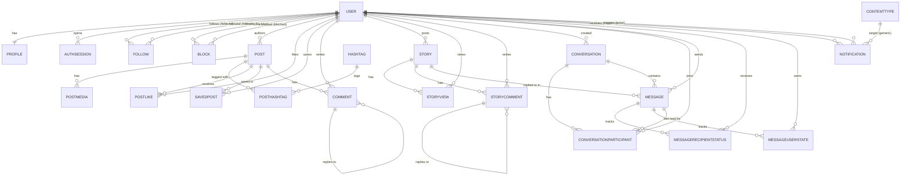

# Instagram Clone

A full Instagram-style social network: a Django REST Framework backend with a
React single-page frontend. It covers profiles, posts, stories, an explore feed,
search, direct and group messaging, and notifications.

The backend uses passwordless authentication (one-time codes sent over email or
phone), a service-layer architecture, Redis for OTP/rate-limits/caching, and
ships with full OpenAPI documentation.

> **Note:** The backend is my own work. I'm a backend developer, so the React
> frontend was built with AI assistance — it exists to exercise every API
> endpoint end to end.

## Tech stack

- **Backend:** Django 6, Django REST Framework, drf-spectacular (OpenAPI), SimpleJWT
- **Auth:** passwordless OTP (email or phone) + JWT access/refresh tokens
- **Datastores:** PostgreSQL (primary), Redis (OTP, rate limiting, counters, feed cache)
- **Frontend:** React 19 + Vite + Tailwind CSS, React Router, Axios
- **Infra:** Docker Compose (web + Postgres + Redis)

## Features

- **Accounts** – request/verify OTP login & signup over email or phone, JWT
  refresh & logout (token blacklist), add or change email/phone via OTP, delete
  account.
- **Profiles** – edit display name, bio, avatar and privacy; view public profiles.
- **Social graph** – follow/unfollow, followers / following / mutual lists,
  block/unblock with a blocked-users list.
- **Posts** – multi-image and video posts, home feed, like, save, threaded
  comments, per-post view counts and hashtags.
- **Stories** – 24-hour stories grouped per user, story viewer with view tracking,
  viewers list, story comments and story replies.
- **Explore & search** – explore feed plus user, post and hashtag search.
- **Messaging** – direct and group conversations, text / image / video / file
  messages, story replies, delivered/read/seen receipts, archive (hide) and
  delete-for-me / delete-for-everyone. Delivered with polling.
- **Notifications** – activity feed with unread count, mark-read / mark-all-read
  and clear. Delivered with polling.

## Running with Docker

The whole stack (web, PostgreSQL, Redis) runs from Docker Compose.

```bash
cp .env.example .env        # then set SECRET_KEY and review the values
docker compose up --build
```

On start the web container runs migrations and serves on
[http://localhost:8000](http://localhost:8000). The database and Redis come up
first (health-checked) so the web service waits for them.

- API base: `http://localhost:8000/api/`
- Interactive API docs (Swagger UI): `http://localhost:8000/api/docs/`
- OpenAPI schema: `http://localhost:8000/api/schema/`
- Django admin: `http://localhost:8000/admin/`

Management commands run inside the web container, for example:

```bash
docker compose exec web python manage.py createsuperuser
docker compose exec web python manage.py seed_demo      # demo data, see below
```

## Demo data

`seed_demo` populates the database with demo users, profiles, follows, posts,
comments, stories and a couple of conversations so the app is not empty on a
fresh install:

```bash
docker compose exec web python manage.py seed_demo
```

Every demo account uses the username as both a username and a memorable login.
Because login is passwordless, sign in by requesting an OTP for a demo user's
email; in `DEBUG` mode the code is returned in the response (and printed to the
console email backend).

## Frontend

The React app lives in `frontend/` and talks to the API base URL.

```bash
cd frontend
npm install
npm run dev                 # http://localhost:5173
```

By default it calls `http://localhost:8000`. To point elsewhere, set
`VITE_API_BASE_URL` in `frontend/.env`. CORS already allows the Vite dev server
origin.

## Authentication flow

Login and signup are passwordless:

1. `POST /api/auth/otp/request/` with an email or phone and a purpose
   (`login` or `signup`).
2. The code is delivered by email/SMS. In `DEBUG` it is also returned as
   `dev_code` for convenience.
3. `POST /api/auth/otp/verify/` with the code returns JWT access and refresh
   tokens.
4. Send `Authorization: Bearer <access>` on subsequent requests; refresh with
   `POST /api/auth/token/refresh/`.

Rate limiting (per IP) and a resend cooldown are enforced through Redis.

## How Redis is used

PostgreSQL is the source of truth; Redis is a fast side-store:

- **OTP codes** and the resend cooldown (keyed by channel + target).
- **Rate limits** for login and signup (fixed-window counters per IP).
- **Follower / following counters** (cache-aside, invalidated on follow/unfollow/block).
- **Home feed** post-id list per user (short TTL, invalidated on post create/delete).

## API overview

| Prefix | Area |
| --- | --- |
| `/api/auth/` | OTP login/signup, JWT refresh/logout, email/phone management |
| `/api/profiles/` | Profile view & edit |
| `/api/social/` | Follow, block, followers/following/mutual lists |
| `/api/posts/` | Posts, media, likes, saves, comments |
| `/api/stories/` | Stories, views, story comments |
| `/api/feed/` | Explore feed and search |
| `/api/messaging/` | Conversations and messages |
| `/api/notifications/` | Notification feed |

The full, always-current reference is the Swagger UI at `/api/docs/`.

## Project structure

```
config/         Django project (settings, root urls)
common/         Shared abstract models (timestamps, soft delete)
accounts/       User model + OTP auth + sessions
profiles/       User profiles
social/         Follow / block
posts/          Posts, media, comments, likes, saves, hashtags
stories/        Stories, views, story comments
feed/           Explore feed + search
messaging/      Conversations, messages, receipts
notifications/  Notifications
frontend/       React + Vite single-page app
```

Each app keeps views thin and delegates to a `services` layer; models use soft
deletes and timestamp mixins from `common`.

## Data model

The diagram below is the current schema (also in
[`ERD.md`](ERD.md); a draw.io version is in
[`ERD.drawio`](ERD.drawio) / `ERD.png`). All tables carry `created_at` /
`updated_at`; soft-deletable tables also have `deleted_at`.



## Environment variables

See [`.env.example`](.env.example) for the full list. Key settings:

| Variable | Purpose |
| --- | --- |
| `SECRET_KEY` | Django secret key |
| `DEBUG` | Debug mode (returns `dev_code`, serves media) |
| `ALLOWED_HOSTS` | Comma-separated allowed hosts |
| `DB_*` | PostgreSQL connection |
| `REDIS_URL` | Redis connection |
| `CORS_ALLOWED_ORIGINS` | Allowed frontend origins |
| `EMAIL_*` | SMTP settings for OTP email delivery |
